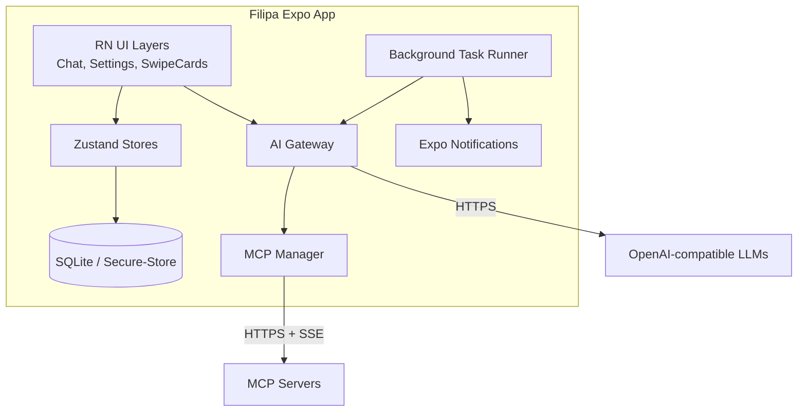
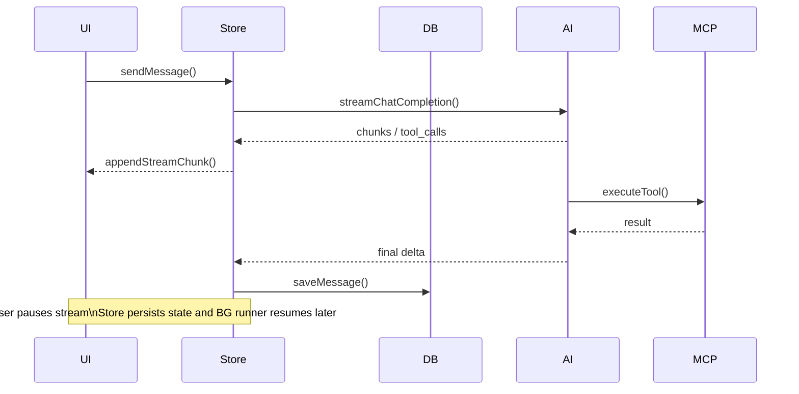
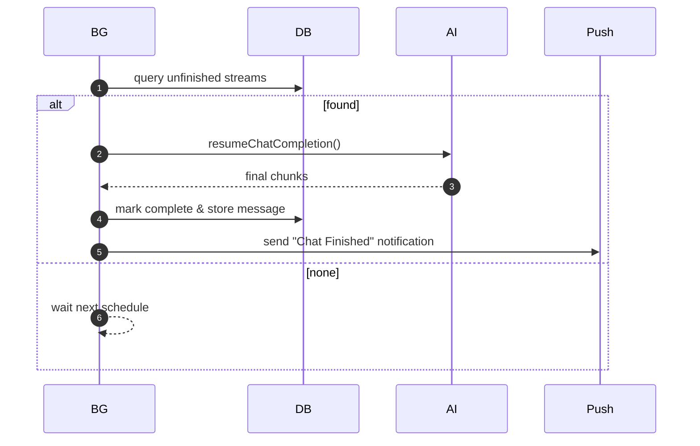

# Filipa AI – Architecture Document

## Table of Contents

* [Technical Summary](#technical-summary)
* [High‑Level Overview](#high-level-overview)
* [Component View](#component-view)

  * [Architectural / Design Patterns Adopted](#architectural--design-patterns-adopted)
* [API Reference](#api-reference)

  * [External APIs Consumed](#external-apis-consumed)
  * [Internal APIs Provided](#internal-apis-provided)
* [Data Models](#data-models)

  * [Core Entities](#core-entities)
  * [Database Schemas](#database-schemas)
  * [State File Schemas](#state-file-schemas)
* [Core Workflow / Sequence Diagrams](#core-workflow--sequence-diagrams)
* [Error Handling Strategy](#error-handling-strategy)
* [Testing Strategy](#testing-strategy)

## Technical Summary

Filipa is a privacy‑first mobile chat app built with **Expo SDK 53** (React Native, TypeScript 5 strict). All user data are stored locally: SQLite for chat/notification records, **`expo-secure-store`** for API keys, AsyncStorage for non‑sensitive prefs. The AI gateway streams responses from OpenAI‑compatible LLMs, enriches them through **Model Context Protocol (MCP)** tool calls, and enforces resumable, time‑boxed execution so long tasks can pause and resume under iOS/Android background limits.

Key adjustments after user feedback:

* **Swipe deck** uses **`rn-swiper-list`** for HITL confirmations.

* **MCP Client configuration** is user‑editable JSON stored in Secure Store:

  ```json
  {
    "react-native Docs": {
      "url": "https://gitmcp.io/facebook/react-native",
      "headers": { "Authorization": "Bearer <token>" }
    }
  }
  ```

* **Message storage** supports tool‑call linkage, raw payload, streaming flags. Chats can **start / pause / stop**; if interrupted, background tasks replay from the last fully stored message.

* **Background Task Orchestrator** (Expo BackgroundTask / WorkManager) finishes interrupted streams; completions trigger Expo push + local notifications.

## High‑Level Overview

Filipa is a **mobile‑first monorepo** with feature‑sliced folders (`app/`, `components/`, `store/`, `utils/`). Overall data flow:



## Component View

| Layer                       | Responsibilities                                                                                                                                                                                                                                         |
| --------------------------- | -------------------------------------------------------------------------------------------------------------------------------------------------------------------------------------------------------------------------------------------------------- |
| **UI**                      | Screens (`ChatPage`, `Settings`), Swipe‑card overlay (`rn-swiper-list`), Drawer; reads colors/type from constants. Uses **`react-native-markdown-display`** for flicker‑free streaming markdown inside virtualised `FlashList`.                          |
| **State (Zustand)**         | `chatStore`, `chatHistoryStore`, `mcpStore`, `notificationStore`, `settingsStore`.                                                                                                                                                                       |
| **Data Access**             | `utils/Database.ts`, `notificationDb.ts` implement repository pattern over SQLite (optional SQLCipher). `utils/ModelStore.ts` wraps **`expo-secure-store`** for all settings and API keys; AsyncStorage is a fallback for strictly non‑sensitive values. |
| **AI Gateway**              | `AiApiClient.ts` streams, pauses, resumes; saves raw chunks; retries via BG runner.                                                                                                                                                                      |
| **MCP Manager**             | Discovers servers from JSON config, converts tool manifests, toggles tool activation.                                                                                                                                                                    |
| **Background Runner**       | Expo BackgroundTask & WorkManager; polls for `messages.seen=0 AND isStreaming=1` rows, re‑issues requests, marks complete.                                                                                                                               |
| **Notification Dispatcher** | Queues Expo push + in‑app alerts on completion or human confirmation required.                                                                                                                                                                           |

### Architectural / Design Patterns Adopted

* **Repository & Adapter** – decouple DB/SecureStore from business logic.
* **State Machine per Chat Stream** – controls start/pause/stop and background resume.
* **Feature‑slice structure** – small typed files with JSDoc.
* **Dependency Injection** – swap LLM provider, markdown renderer, swipe deck.

## API Reference

### External APIs Consumed

* **OpenAI Chat Completions** – `POST /chat/completions` (streaming).
* **MCP Servers** – `GET /.well-known/mcp.json`, `POST /tool/<name>`; SSE streams allowed.
* **Expo Push** – `POST https://exp.host/--/api/v2/push/send`.

### Internal APIs Provided

* **GET /health** (Expo Router API route) – diagnostics.

## Data Models

### Core Entities

```typescript
export interface Chat { uuid: string; title: string; createdAt: number; updatedAt: number; }
export interface Message {
  id: string;
  chatId: number;
  model: string;
  role: 'user'|'assistant'|'tool';
  content?: string;
  name?: string;
  toolCalls?: ToolCall[];
  toolCallId?: string;
  timestamp: string; // ISO 8601
  data?: any;
  response?: any;
  rawMessage: any;
  seen: boolean;
}

export interface Settings {
  apiKeys: {
    openai?: string;
    groq?: string;
    gemini?: string;
  };
  selectedModelIds: {
    openai?: string;
    groq?: string;
    gemini?: string;
  };
  userProfile: {
    name?: string;
    language?: string;
    country?: string;
    geoLocation?: string;
  };
  mcpServers: Record<string, {
    url: string;
    headers?: Record<string,string>;
  }>;
  theme: 'light' | 'dark';
  lastActiveChatUUID?: string;
}
```

A dedicated **`settingsStore`** (Zustand) persists this structure with **`expo-secure-store`** (encrypted at rest; optional non‑sensitive prefs may use AsyncStorage) and exposes mutators for API‑key entry, model selection (fetched live from each provider’s `/models` endpoint), and user profile updates.

### Database Schemas

```sql
CREATE TABLE chats (
  id INTEGER PRIMARY KEY AUTOINCREMENT,
  uuid TEXT UNIQUE NOT NULL,
  title TEXT,
  created_at INTEGER,
  updated_at INTEGER
);

CREATE TABLE messages (
  id TEXT PRIMARY KEY,
  chat_id INTEGER NOT NULL,
  model TEXT NOT NULL,
  role TEXT NOT NULL,
  content TEXT,
  name TEXT,
  tool_calls TEXT,
  tool_call_id TEXT,
  timestamp TEXT NOT NULL DEFAULT CURRENT_TIMESTAMP,
  data TEXT,
  response TEXT,
  raw_message TEXT NOT NULL,
  seen BOOLEAN DEFAULT 0 NOT NULL,
  FOREIGN KEY (chat_id) REFERENCES chats (id) ON DELETE CASCADE
);

CREATE TABLE notifications (
  id TEXT PRIMARY KEY,
  title TEXT,
  body TEXT,
  seen INTEGER DEFAULT 0,
  created_at INTEGER
);
```

### State File Schemas

```json
{
  "apiKeys": {
    "openai": "sk-...",
    "groq": "gk-...",
    "gemini": ""
  },
  "selectedModelIds": {
    "openai": "gpt-4o",
    "groq": "mixtral-8x7b",
    "gemini": "gemini-1.5-pro"
  },
  "mcpServers": {
    "react-native Docs": {
      "url": "https://gitmcp.io/facebook/react-native",
      "headers": { "Authorization": "Bearer …" }
    }
  },
  "userProfile": {
    "name": "Alex",
    "language": "en",
    "country": "DE",
    "geoLocation": "52.52,13.40"
  },
  "lastActiveChatUUID": "string",
  "theme": "light"
}
```

## Core Workflow / Sequence Diagrams

### 1. Streamed Chat With MCP Tool Calls



### 2. Background Runner Completing Interrupted Streams



## Error Handling Strategy

* **General Approach:** Throw typed errors (`AppError`) and surface via global error boundary; toast user‑friendly messages.
* **Logging:**

  * Use `expo-file-system` + `console.*` in dev; production logs written JSON‑formatted with level tags (`DEBUG`, `INFO`, `WARN`, `ERROR`).
  * Critical errors (uncaught, AI gateway failures) flagged for Sentry (optional, toggleable).
* **External API Calls:** Retries with exponential backoff (`max 3`, jitter). Distinguish between 4xx (user/API‑key issue) and 5xx (retry‑able).
* **Database Ops:** Wrapped in transactions; on corruption, attempt export & reset with user confirmation.
* **Background Tasks:** If a resume attempt fails 3×, mark message `seen=false` & `error` flag; notify user.

## Testing Strategy

### Philosophy & Goals

Catch regressions early with fast unit tests, ensure integration flow (AI stream, MCP tool call, DB write) functions on device, and verify UX with Detox E2E.

### Testing Levels

| Level           | Tool                                  | Scope                          | Location                                   | Naming       |
| --------------- | ------------------------------------- | ------------------------------ | ------------------------------------------ | ------------ |
| **Unit**        | Jest 29                               | Pure functions, stores         | `__tests__/` co‑located or parallel folder | `*.test.ts`  |
| **Integration** | Jest + `react-native-testing-library` | Component + store interactions | `__tests__/integration/`                   | `*.spec.tsx` |
| **E2E**         | Detox                                 | Full RN app on simulator       | `e2e/`                                     | `*.e2e.ts`   |

### Additional Notes

* Mocks for `expo-sqlite`, Secure Store, and network provided in `jest.setup.ts`.
* CI runs GitHub Actions matrix: `node 18`, `iOS`, `Android`; Detox only on push to `main`.
* Coverage threshold: **80 %** lines/branches on unit tests; integration/E2E excluded from threshold.