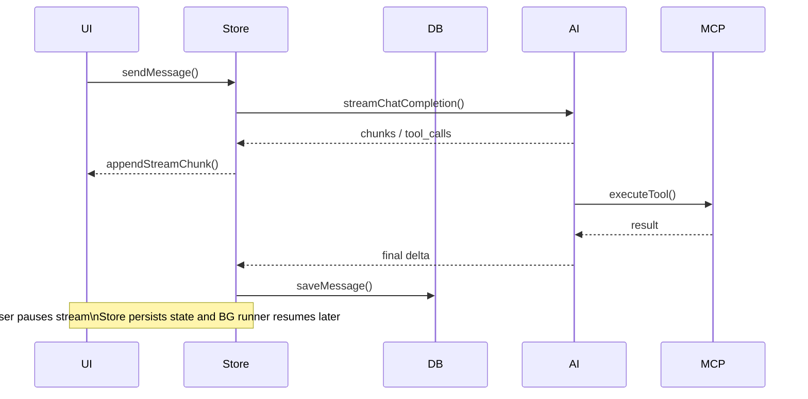
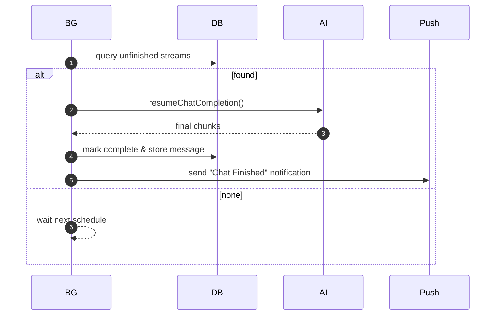

# Filipa AI – Architecture Document

## Table of Contents

* [Technical Summary](#technical-summary)
* [High‑Level Overview](#high-level-overview)
* [Component View](#component-view)

  * [Architectural / Design Patterns Adopted](#architectural--design-patterns-adopted)
* [API Reference](#api-reference)

  * [External APIs Consumed](#external-apis-consumed)
  * [Internal APIs Provided](#internal-apis-provided)
* [Data Models](#data-models)

  * [Core Entities](#core-entities)
  * [Database Schemas](#database-schemas)
  * [State File Schemas](#state-file-schemas)
* [Core Workflow / Sequence Diagrams](#core-workflow--sequence-diagrams)
* [Error Handling Strategy](#error-handling-strategy)
* [Testing Strategy](#testing-strategy)

## Technical Summary

Filipa is a privacy‑first mobile chat app built with **Expo SDK 53** (React Native, TypeScript 5 strict). All user data are stored locally: SQLite for chat/notification records, \`\` for API keys, AsyncStorage for non‑sensitive prefs. The AI gateway streams responses from OpenAI‑compatible LLMs, enriches them through **Model Context Protocol (MCP)** tool calls, and enforces resumable, time‑boxed execution so long tasks can pause and resume under iOS/Android background limits.

Key adjustments after user feedback:

* **Swipe deck** uses \`\` for HITL confirmations.

* **MCP Client configuration** is user‑editable JSON stored in Secure Store:

  ```json
  {
    "react-native Docs": {
      "url": "https://gitmcp.io/facebook/react-native",
      "headers": { "Authorization": "Bearer <token>" }
    }
  }
  ```

* **Message storage** supports tool‑call linkage, raw payload, streaming flags. Chats can **start / pause / stop**; if interrupted, background tasks replay from the last fully stored message.

* **Background Task Orchestrator** (Expo BackgroundTask / WorkManager) finishes interrupted streams; completions trigger Expo push + local notifications.

## High‑Level Overview

Filipa is a **mobile‑first monorepo** with feature‑sliced folders (`app/`, `components/`, `store/`, `utils/`). Overall data flow:

```mermaid
graph TD
  subgraph Mobile_App[Filipa Expo App]
    UI[RN UI Layers\nChat, Settings, SwipeCards]
    State[Zustand Stores]
    DB[(SQLite / Secure‑Store)]
    AI[AI Gateway]
    MCP[MCP Manager]
    BG[Background Task Runner]
    Push[Expo Notifications]
  end
  UI --> State
  State --> DB
  UI --> AI
  AI -->|HTTPS| LLM[OpenAI‑compatible LLMs]
  AI --> MCP
  MCP -->|HTTPS + SSE| MCP_Srv[MCP Servers]
  BG --> AI
  BG --> Push
```



## Project Structure & Best Practices

Below is the recommended folder layout and guard‑rails that the codebase MUST follow. This keeps routing thin, isolates domain logic, and scales well for multiple contributors.

```text
my-chat-app/
├─ app/                     # 🚦 Expo Router screens only
│  ├─ _layout.tsx
│  ├─ +not-found.tsx
│  ├─ chat/
│  │   ├─ index.tsx         # list
│  │   └─ conversation.tsx
│  └─ settings/…
├─ modules/                 # 💡 feature‑driven code
│  ├─ chat/
│  │   ├─ components/
│  │   ├─ hooks/
│  │   ├─ store.ts          # Zustand slice (persist + immer)
│  │   ├─ services/         # data repo → SQLite via Drizzle
│  │   └─ __tests__/
│  └─ auth/…
├─ db/
│  ├─ schema.ts             # Drizzle schema definitions
│  ├─ client.ts             # drizzle(expoSqlite)
│  └─ migrations/           # generated .sql files – run on app start
├─ libs/                    # shared utilities (logger, i18n, theme)
├─ assets/
├─ .husky/                  # git hooks (lint, commit‑msg)
├─ .github/workflows/
├─ jest.config.js
├─ tsconfig.json
└─ expo-env.d.ts
```

### Guard‑rails & Tooling

| Purpose         | Packages / Settings                                                  | Mandatory rules                                 |
| --------------- | -------------------------------------------------------------------- | ----------------------------------------------- |
| **TypeScript**  | `strict`, `exactOptionalPropertyTypes`, path‑aliases (`@/modules/*`) | Ban `any`; CI fails on TS errors.               |
| **Lint/Format** | `eslint-config-universe`, `@react-native/eslint-plugin`, Prettier    | Run via Husky `pre-commit` + `lint-staged`.     |
| **Commits**     | `@commitlint/config-conventional`                                    | Conventional commits enforced.                  |
| **Tests**       | `jest-expo`, `@testing-library/react-native`                         | Tests live outside `/app`; mock native modules. |
| **DB**          | `expo-sqlite` + **Drizzle ORM** (`drizzle-orm`, `drizzle-kit`)       | Typed queries & offline migrations.             |
| **CI/CD**       | GitHub Actions + `expo/expo-github-action`, EAS Build                | Lint → test → build artefacts.                  |

### Coding Guidelines

1. **Feature ownership** – every module owns its slice, components, tests; expose public API via `index.ts`.
2. **Zustand contract** – slices use `persist` + `immer`; external code mutates state only through exported hooks/selectors.
3. **Repository layer** – UI talks to services that wrap Drizzle; swapping storage stays trivial.
4. **Async boundaries** – never call `fetch` directly in components; use service functions or TanStack Query.
5. **Accessibility** – adhere to WCAG AA; components include `accessibilityRole`, `accessibilityLabel`.
6. **Error boundary** – `_layout.tsx` mounts global `<ErrorBoundary>`; prod errors report to Sentry.
7. **Testing pyramid** – fast unit tests → component tests → optional Detox/Playwright e2e.
8. **CI gates** – build fails on lint/test/TS errors; PR template checklist is mandatory.

---

## Component View

| Layer                       | Responsibilities                                                                                                                                                                                                                      |
| --------------------------- | ------------------------------------------------------------------------------------------------------------------------------------------------------------------------------------------------------------------------------------- |
| **UI**                      | Screens (`ChatPage`, `Settings`), Swipe‑card overlay (`rn-swiper-list`), Drawer; reads colors/type from constants. Uses \`\` for flicker‑free streaming markdown inside virtualised `FlashList`.                                      |
| **State (Zustand)**         | `chatStore`, `chatHistoryStore`, `mcpStore`, `notificationStore`, `settingsStore`.                                                                                                                                                    |
| **Data Access**             | `utils/Database.ts`, `notificationDb.ts` implement repository pattern over SQLite (optional SQLCipher). `utils/ModelStore.ts` wraps \`\` for all settings and API keys; AsyncStorage is a fallback for strictly non‑sensitive values. |
| **AI Gateway**              | `AiApiClient.ts` streams, pauses, resumes; saves raw chunks; retries via BG runner.                                                                                                                                                   |
| **MCP Manager**             | Discovers servers from JSON config, converts tool manifests, toggles tool activation.                                                                                                                                                 |
| **Background Runner**       | Expo BackgroundTask & WorkManager; polls for `messages.seen=0 AND isStreaming=1` rows, re‑issues requests, marks complete.                                                                                                            |
| **Notification Dispatcher** | Queues Expo push + in‑app alerts on completion or human confirmation required.                                                                                                                                                        |

### Architectural / Design Patterns Adopted

* **Repository & Adapter** – decouple DB/SecureStore from business logic.
* **State Machine per Chat Stream** – controls start/pause/stop and background resume.
* **Feature‑slice structure** – small typed files with JSDoc.
* **Dependency Injection** – swap LLM provider, markdown renderer, swipe deck.

## API Reference

### External APIs Consumed

* **OpenAI Chat Completions** – `POST /chat/completions` (streaming).
* **MCP Servers** – `GET /.well-known/mcp.json`, `POST /tool/<name>`; SSE streams allowed.
* **Expo Push** – `POST https://exp.host/--/api/v2/push/send`.

### Internal APIs Provided

* **GET /health** (Expo Router API route) – diagnostics.

## Data Models

### Core Entities

```typescript
export interface Chat { uuid: string; title: string; createdAt: number; updatedAt: number; }
export interface Message {
  id: string;
  chatId: number;
  model: string;
  role: 'user'|'assistant'|'tool';
  content?: string;
  name?: string;
  toolCalls?: ToolCall[];
  toolCallId?: string;
  timestamp: string; // ISO 8601
  data?: any;
  response?: any;
  rawMessage: any;
  seen: boolean;
}

export interface Settings {
  apiKeys: {
    openai?: string;
    groq?: string;
    gemini?: string;
  };
  selectedModelIds: {
    openai?: string;
    groq?: string;
    gemini?: string;
  };
  userProfile: {
    name?: string;
    language?: string;
    country?: string;
    geoLocation?: string;
  };
  mcpServers: Record<string, {
    url: string;
    headers?: Record<string,string>;
  }>;
  theme: 'light' | 'dark';
  lastActiveChatUUID?: string;
}
```

A dedicated `(Zustand) persists this structure with` (encrypted at rest; optional non‑sensitive prefs may use AsyncStorage) and exposes mutators for API‑key entry, model selection (fetched live from each provider’s `/models` endpoint), and user profile updates.

### Database Schemas

```sql
CREATE TABLE chats (
  id INTEGER PRIMARY KEY AUTOINCREMENT,
  uuid TEXT UNIQUE NOT NULL,
  title TEXT,
  created_at INTEGER,
  updated_at INTEGER
);

CREATE TABLE messages (
  id TEXT PRIMARY KEY,
  chat_id INTEGER NOT NULL,
  model TEXT NOT NULL,
  role TEXT NOT NULL,
  content TEXT,
  name TEXT,
  tool_calls TEXT,
  tool_call_id TEXT,
  timestamp TEXT NOT NULL DEFAULT CURRENT_TIMESTAMP,
  data TEXT,
  response TEXT,
  raw_message TEXT NOT NULL,
  seen BOOLEAN DEFAULT 0 NOT NULL,
  FOREIGN KEY (chat_id) REFERENCES chats (id) ON DELETE CASCADE
);

CREATE TABLE notifications (
  id TEXT PRIMARY KEY,
  title TEXT,
  body TEXT,
  seen INTEGER DEFAULT 0,
  created_at INTEGER
);
```

### State File Schemas

```json
{
  "apiKeys": {
    "openai": "sk-...",
    "groq": "gk-...",
    "gemini": ""
  },
  "selectedModelIds": {
    "openai": "gpt-4o",
    "groq": "mixtral-8x7b",
    "gemini": "gemini-1.5-pro"
  },
  "mcpServers": {
    "react-native Docs": {
      "url": "https://gitmcp.io/facebook/react-native",
      "headers": { "Authorization": "Bearer …" }
    }
  },
  "userProfile": {
    "name": "Alex",
    "language": "en",
    "country": "DE",
    "geoLocation": "52.52,13.40"
  },
  "lastActiveChatUUID": "string",
  "theme": "light"
}
```

## Core Workflow / Sequence Diagrams

### 1. Streamed Chat With MCP Tool Calls



### 2. Background Runner Completing Interrupted Streams



## Error Handling Strategy

* **General Approach:** Throw typed errors (`AppError`) and surface via global error boundary; toast user‑friendly messages.
* **Logging:**

  * Use `expo-file-system` + `console.*` in dev; production logs written JSON‑formatted with level tags (`DEBUG`, `INFO`, `WARN`, `ERROR`).
  * Critical errors (uncaught, AI gateway failures) flagged for Sentry (optional, toggleable).
* **External API Calls:** Retries with exponential backoff (`max 3`, jitter). Distinguish between 4xx (user/API‑key issue) and 5xx (retry‑able).
* **Database Ops:** Wrapped in transactions; on corruption, attempt export & reset with user confirmation.
* **Background Tasks:** If a resume attempt fails 3×, mark message `seen=false` & `error` flag; notify user.

## Testing Strategy

### Philosophy & Goals

Catch regressions early with fast unit tests, ensure integration flow (AI stream, MCP tool call, DB write) functions on device, and verify UX with Detox E2E.

### Testing Levels

| Level           | Tool                                  | Scope                          | Location                                   | Naming       |
| --------------- | ------------------------------------- | ------------------------------ | ------------------------------------------ | ------------ |
| **Unit**        | Jest 29                               | Pure functions, stores         | `__tests__/` co‑located or parallel folder | `*.test.ts`  |
| **Integration** | Jest + `react-native-testing-library` | Component + store interactions | `__tests__/integration/`                   | `*.spec.tsx` |
| **E2E**         | Detox                                 | Full RN app on simulator       | `e2e/`                                     | `*.e2e.ts`   |

### Additional Notes

* Mocks for `expo-sqlite`, Secure Store, and network provided in `jest.setup.ts`.
* CI runs GitHub Actions matrix: `node 18`, `iOS`, `Android`; Detox only on push to `main`.
* Coverage threshold: **80 %** lines/branches on unit tests; integration/E2E excluded from threshold.